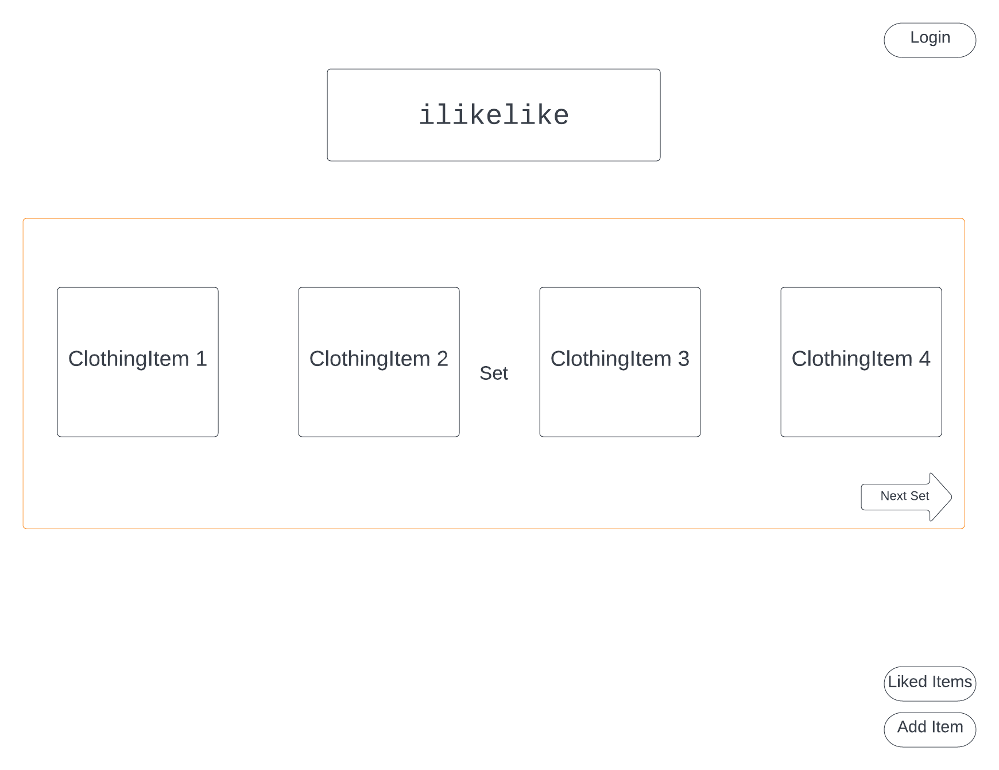
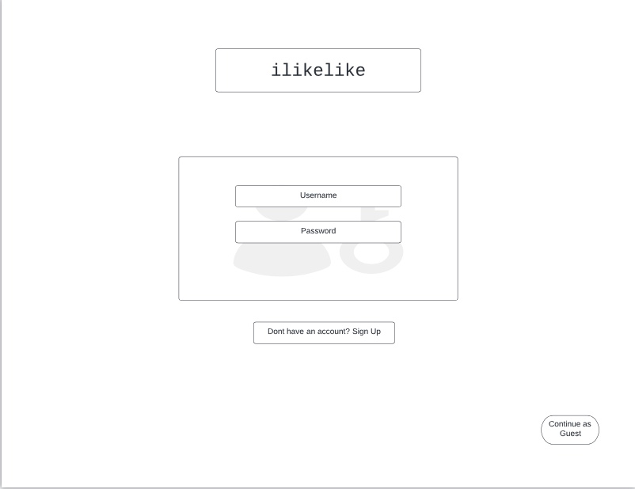
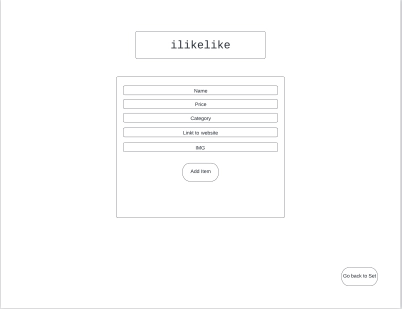
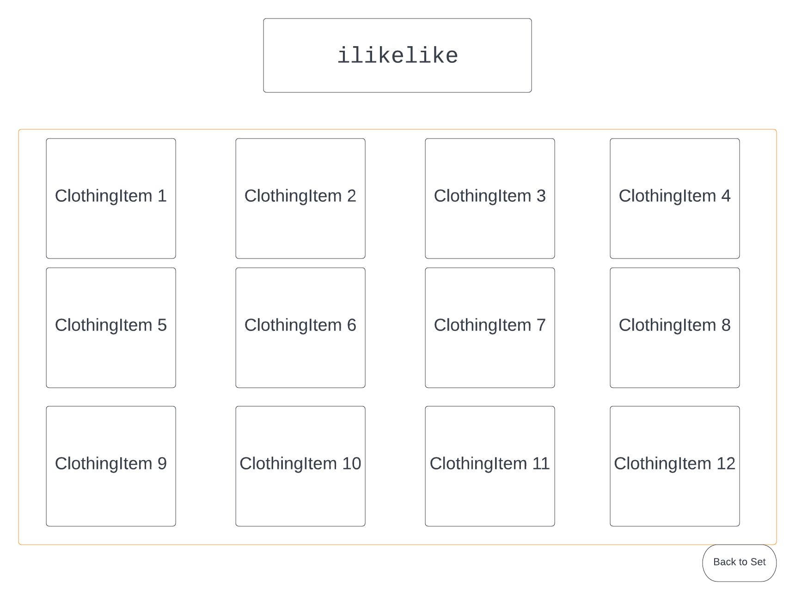
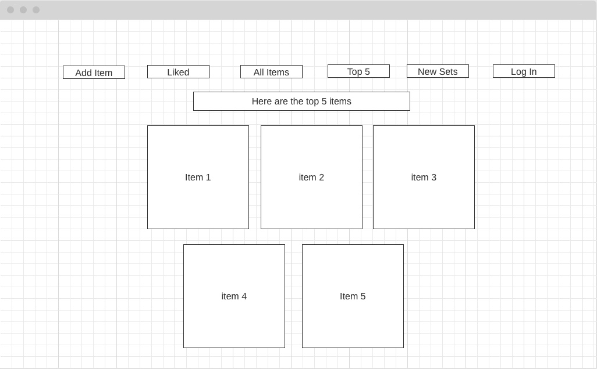
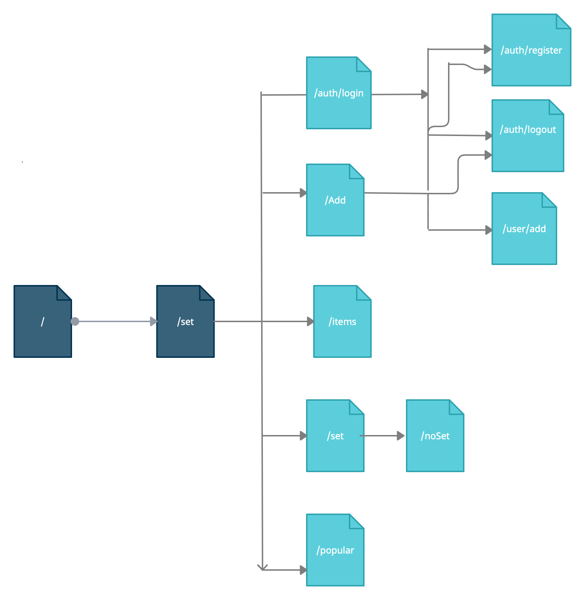

The content below is an example project proposal / requirements document. Replace the text below the lines marked "__TODO__" with details specific to your project. Remove the "TODO" lines.


ilikelike

## Overview

Its hard to stay on top of the freshest and coolest fashion trends. Its also hard to new and unique clothes online. Often times we waste our time scrolling through the same website seing the same boring clothes. This can all change thanks to ilikelike. ilikelike is a web app that will allow users to discover new clothing and vote for which item, out of a set, they like best. After voting users can see the percentages of votes for each item and see which item is most popular. After, for each item a link will be displayed to the page where the item can be bought. Users can decide to go to the item's url or continue exploring new sets. Users can register and login. Once they're logged in, they can create clothing items and add to the database so these items then appear on future sets. Users will also be able to view recent sets in case they want to go back to view some item.


## Data Model


The application will store Users, Sets and ClothingItems

* users will have an array of their seen sets's object ids so that these set do not appear again (via references)
* users will have an array of their liked items ids so that these appear on /user/liked or /liked(if user is not authenticated)
* users will vote on the ClothingItem of the set they like best, then percentages of the Items votes over the total Set votes will be displayed
* each Set will contain an array of four ClothingItems object ids.
* Sets will be generated from available ClothingItems


An Example User:

```javascript
{
  username: "aleolazabal",
  seenSets: [1edd40c86762e0fb12002003, 2fdd40c86762e0fb12002003] //some set object id
  likedItems: [2edd40c86762e0fb121302003] //Object id
}
```
An Example of ClothingItem:

```javascript
{
  _id: ...,
  name: "Ripped Skinny Jeans",
  category : "mens-bottoms",
	price: 16.00,
	storeLink : "https://www.depop.com/products/edward_morales-ripped-skinny-jeans-excellent-condition-43c3/",
	imgUrl : "https://media-photos.depop.com/b0/34984709/1196897944_83b526e64756443485669e62a75d9e02/P0.jpg",
	votes : 14,
	inSet : false,
  set : 2edd40c86762d0fb12002002 //set id
}
```
An Example Set with ClothingItems:

```javascript
{
	_id: ...,
	items : [4edd40c86762e0fb12002003,4edd40c86723e0fb12000003,4edd40c86787e0fb12000001,4edd40c86762e0fb12000003], //four clothingItems ids
	//totalVotes :  112, removed need for this since can be calculated from item.votes
}
```


## [Link to Commented First Draft Schema](db.js) 


## Wireframes

/ - main page where users can view sets of ClothingItems, redirects to /set



/auth/login - page for user login
/auth/registration - page for user login
* similar wire frame only variation will be the link for (Dont have account) for Login or (already have an account) for Registration


/user/add - page for registered user to add ClothingItem



/liked - page for non authenticated user's liked items via sessions
/user/liked - page for authenticated user's liked items via User.likedItems
* page will look the same, items will depend on wether user is authenticated or not


/popular



## Site map



* some changes were made
* user routes such as add and liked are under /user/add and /user/liked
* if user is not authenticated it will go to /liked not /user/liked
* auth routes such as login and register are under /auth/login /auth/register

## User Stories or Use Cases

1. as non-registered user, I can register a new account with the site
2. as non-registered user, I can still vote for ClothingItem in a Set
3. as non-registered user, I can still view liked items but they will only be saved for session
4. as a user, I can log in to the site
5. as a user, I can add items to potentially be placed in a Set
6. as a user, I can view my liked items
7. as a non-registered user, I cannot add items 
8. as a user, seenSets will be saved on User object and will be persisted beyond sessions
9. as a non-registered user, seenSets will only be sotred on sessions

## Research Topics

* (5 points) Integrate user authentication
    * I'm going to be using passport for user authentication
    * With this I will be establishig a Session for Logged In user
    * logged in in users will be able to add items 

* (3 points) Perform client side form validation using a JavaScript library
    * Want to ensure that items to be added by users are valid items, and that there information is not garbage
    * a possible module for this could be express-validator


8 points total out of 8 required points (___TODO__: addtional points will __not__ count for extra credit_)

## [Link to Initial Main Project File](app.js) 

## Annotations / References Used
1. [passport.js authentication docs](http://passportjs.org/docs) - (add link to source code that was based on this)
* added user registration and login options
* ensured that only authenticated users are able to add clothing items to the database
* authenticated users can add images via form at https://ilkelike.herokuapp.com/user/add and items added to database should be visible at https://ilkelike.herokuapp.com/items
2. [express-validator documentation](https://express-validator.github.io/docs/) - (add link to source code that was based on this)
* added validation for https://ilkelike.herokuapp.com/user/addso that a user must enter all fields
  * note -  must be a authenticated user to add item
* and name must be longer than 3 characters, and both image url and store link must be valid url
* if entries are not valid, form doesnt go through and error messages are displayed
* added validation for user login and registration (usernam and password must both be entered, preventing blank entries)


